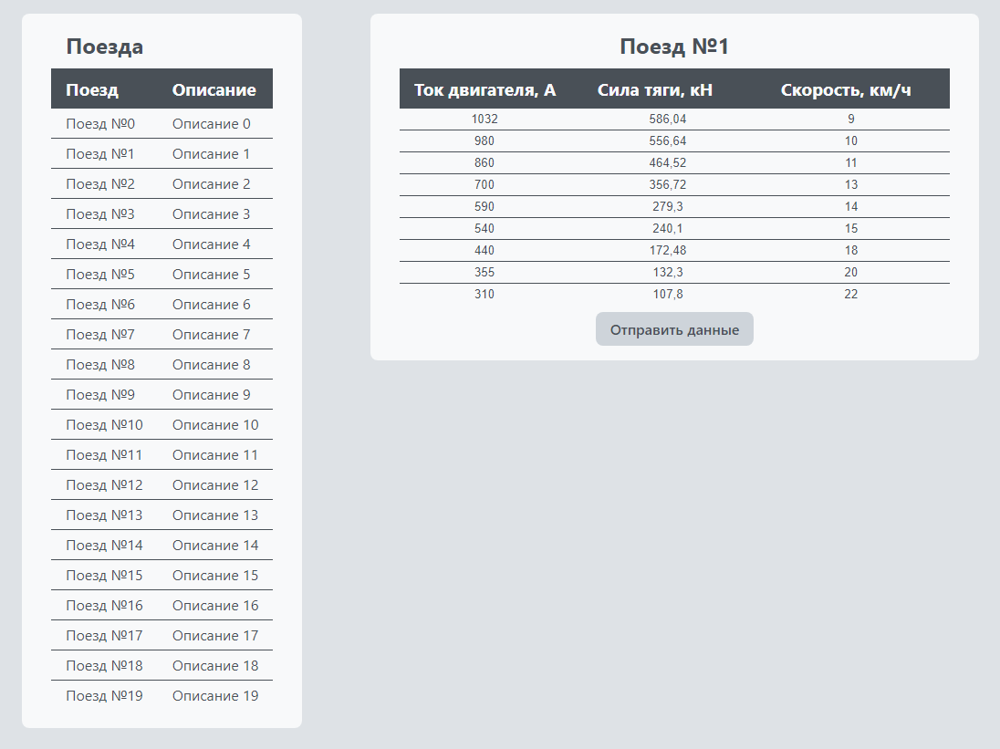

# Тестовое задание ВНИИЖТ

## Деплой приложения

[gh-pages](https://ivan-gav.github.io/rzd-test/)

## Скриншот

## Скрипты

- запустить dev сервер: `npm run dev`
- превью прод сборки: `npm run preview`
- создать прод сборку: `npm run build`
- запустить линтинг: `npm run lint`

## Задание
Требуется создать фронтенд приложение на React.js. 

Изначально в окне должна быть
нередактируемая таблица со списком поездов. Данные необходимо получить по [ссылке](https://gist.githubusercontent.com/orlov-oleg-developer/49f08290d1c59a6851e0a0581900e2a7/raw/e5daf87338f3c75165f8edf4c76cc7ec9c2b4aa9/gistfile1.json).

При клике на строку с поездом должна появляться еще одна таблица — с характеристиками, которые соответствуют выбранному поезду. 

Характеристика представляет собой массив объектов с тремя полями: 
- скорость в км/ч
- сила тяги в кН
- ток двигателя в А. 

Все ячейки таблицы характеристик должны быть доступны пользователю для редактирования. Программа же должна проверять пользовательский ввод на соответствие
следующим условиям:
- скорость — неотрицательное целое число;
- сила тяги — положительное число с плавающей запятой;
- ток двигателя — положительное целое число;

Гарантируется, что загружаемые данные валидны.

Если в таблице присутствуют значения, которые не проходят валидацию, то они подсвечиваются красным, а кнопка «Отправить данные» становится неактивной (на неё нельзя нажать). Если данные проходят валидацию, то при нажатии пользователем на кнопку «Отправить данные» в консоли браузера выводится список скоростных ограничений, отсортированных по возрастанию.

Обязательные требования:
- Приложение должно быть реализовано на Typescript с использованием React 16+ и Redux.
- Верстка таблиц должна быть реализована через table (не div-ми).